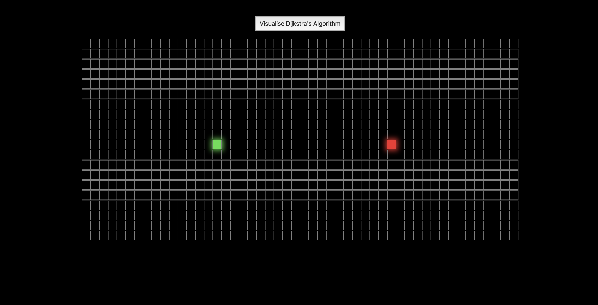

# Dijkstra's Algorithm Visualiser

An interactive web app built with React to visualize popular pathfinding algorithms like **Dijkstra's Algorithm** in real-time.

- Adjustable start and finish nodes
- Animated traversal for better understanding

## Screenshots

## 🛠️ Built With

- React.js
- HTML & CSS (Flexbox/Grid)
- JavaScript (ES6+)
